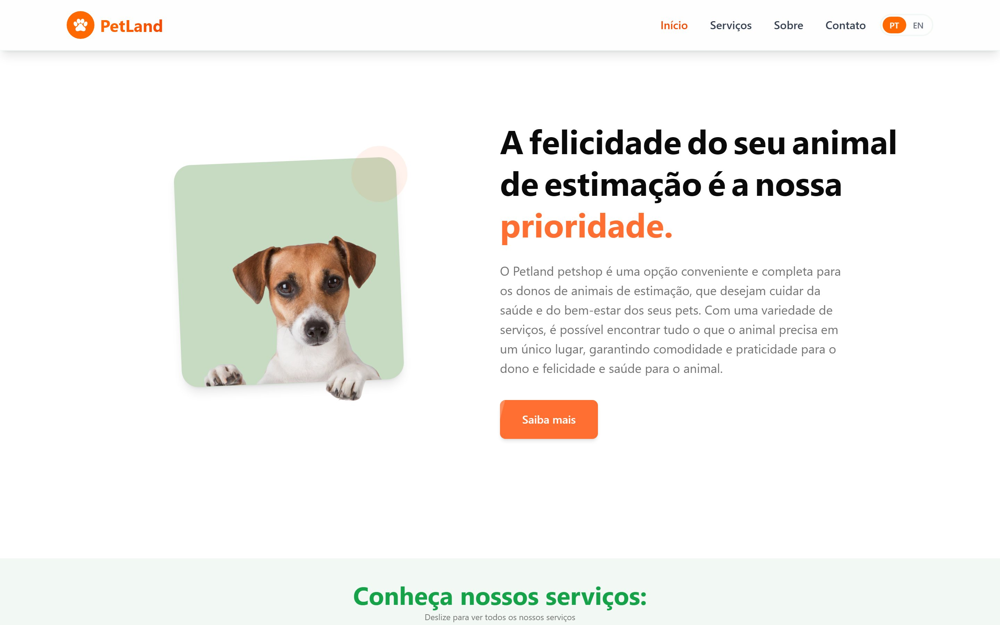
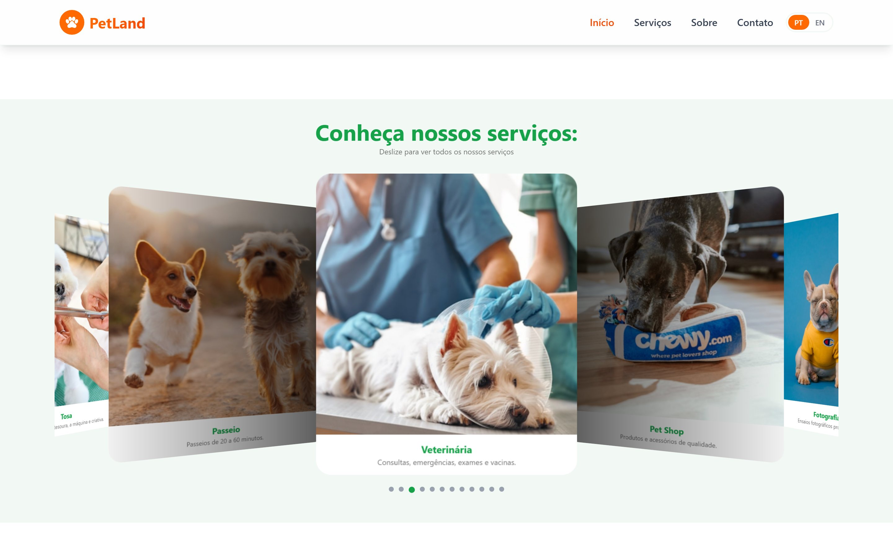
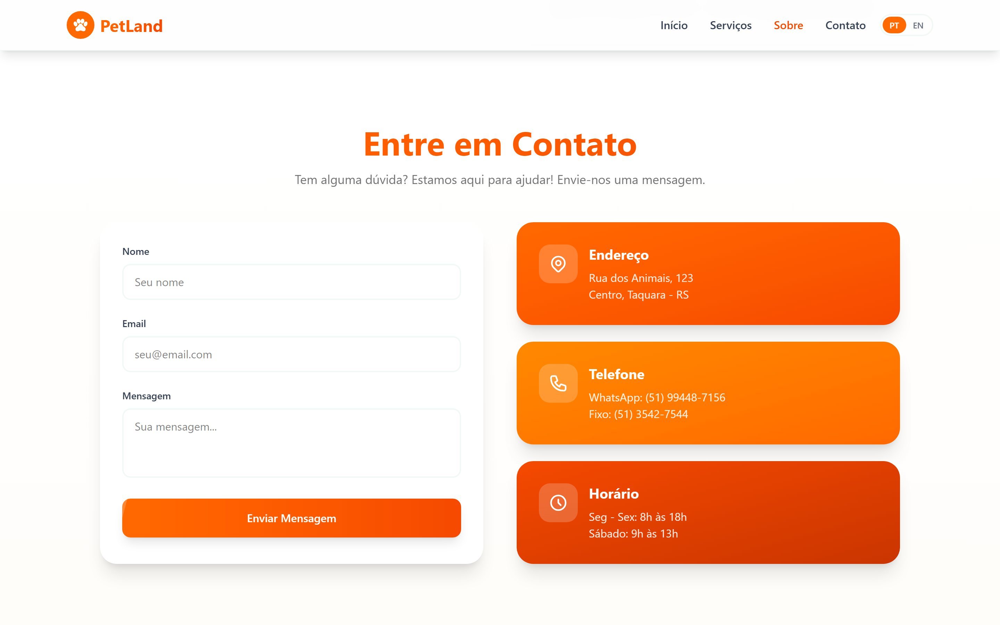

# PetLand

[Português](README.md) | [English](README.en.md)

[](https://plovatto.github.io/PetLand/)

<p align="center"><a href="https://plovatto.github.io/PetLand/"><strong>Ver o projeto ao vivo →</strong></a></p>

Landing page responsiva desenvolvida para um petshop fictício, com foco em uma experiência moderna, agradável, acessível e intuitiva.

O projeto foi criado como parte do meu portfólio pessoal para praticar desenvolvimento front-end, responsividade, organização de componentes, internacionalização e publicação de aplicações React.

> **Nota:** Este é um projeto fictício e não representa uma empresa real.

## Demo

O projeto está publicado no GitHub Pages: **[plovatto.github.io/PetLand](https://plovatto.github.io/PetLand/)**

|                            Serviços                             |                            Contato                             |
| :-------------------------------------------------------------: | :------------------------------------------------------------: |
|  |  |

## Funcionalidades

- Layout responsivo para diferentes tamanhos de tela
- Navegação fluida entre seções
- Animações e microinterações com suporte a redução de movimento
- Smooth scroll com Lenis
- Cursor personalizado
- Page loader
- Seção Hero
- Seção de serviços com carrossel
- Seção Sobre
- Seção de contato com formulário integrado ao EmailJS
- Footer com identidade visual da marca
- Internacionalização em português e inglês
- Troca de idioma com persistência local
- Assets otimizados em WebP
- Deploy automatizado com GitHub Actions e GitHub Pages

## Tecnologias

- [React](https://react.dev/) 19
- [TypeScript](https://www.typescriptlang.org/)
- [Vite](https://vite.dev/)
- [Tailwind CSS](https://tailwindcss.com/) 4
- [Framer Motion](https://motion.dev/) - animações e transições
- [Lenis](https://lenis.darkroom.engineering/) - smooth scroll
- [EmailJS](https://www.emailjs.com/) - envio do formulário de contato
- [Swiper](https://swiperjs.com/) - carrossel de serviços
- [i18next](https://www.i18next.com/) - internacionalização
- [react-i18next](https://react.i18next.com/) - integração do i18n com React
- ESLint - análise e padronização do código
- Prettier - formatação do código
- GitHub Actions - deploy automatizado
- GitHub Pages - hospedagem

## Como Executar

### Pré-requisitos

Antes de começar, tenha instalado:

- [Node.js](https://nodejs.org/)
- npm

### Instalação

Clone o repositório:

```bash
git clone https://github.com/Plovatto/PetLand.git
```

Acesse a pasta do projeto:

```bash
cd PetLand
```

Instale as dependências:

```bash
npm install
```

Crie o arquivo de variáveis de ambiente:

```bash
cp .env.example .env.local
```

Preencha as credenciais do EmailJS em `.env.local` e execute:

```bash
npm run dev
```

O projeto estará disponível em:

```text
http://localhost:5173
```

## Variáveis de Ambiente

As variáveis são definidas no arquivo `.env.local`, que não deve ser versionado.

Utilize `.env.example` como referência:

```env
VITE_EMAILJS_SERVICE_ID=
VITE_EMAILJS_TEMPLATE_ID=
VITE_EMAILJS_PUBLIC_KEY=
```

## Scripts

| Comando                | Descrição                                              |
| ---------------------- | ------------------------------------------------------ |
| `npm run dev`          | Inicia o servidor de desenvolvimento                   |
| `npm run build`        | Executa a checagem de tipos e gera o build de produção |
| `npm run preview`      | Executa localmente o build de produção                 |
| `npm run lint`         | Executa a análise do código com ESLint                 |
| `npm run format`       | Formata o código com Prettier                          |
| `npm run format:check` | Verifica a formatação sem alterar os arquivos          |

## Estrutura do Projeto

```text
src/
├── assets/                 # Imagens e SVGs utilizados pelos componentes
├── components/
│   ├── layout/             # Componentes estruturais, como Header, Footer e PageLoader
│   ├── sections/           # Seções da página, como Hero, Services, About e Contact
│   └── ui/                 # Componentes reutilizáveis, como AnimatedText e LanguageToggle
├── constants/              # Dados estáticos, links e configurações de seções
├── context/                # Contextos globais da aplicação
├── hooks/                  # Hooks customizados
├── lib/                    # Funções utilitárias
├── locales/                # Arquivos de tradução
│   ├── en/
│   └── pt/
├── styles/
│   └── index.css           # Estilos globais e configuração do Tailwind CSS
├── App.tsx
├── i18n.ts
└── main.tsx
```

## Deploy

O deploy é feito com GitHub Actions para o GitHub Pages.

O workflow está em:

```text
.github/workflows/deploy.yml
```

O Vite usa `base: '/PetLand/'` para gerar os caminhos corretos dos assets no GitHub Pages.

Para publicar, configure no GitHub:

```text
Settings > Pages > Build and deployment > Source: GitHub Actions
```

A cada push na branch `main`, o workflow gera o build e publica a pasta `dist`.

## Objetivos do Projeto

O PetLand foi desenvolvido com o objetivo de praticar e demonstrar conhecimentos em:

- Desenvolvimento de interfaces com React e TypeScript
- Criação de layouts responsivos
- Componentização e reutilização de código
- Organização de projetos front-end
- Animações e microinterações
- Acessibilidade e preferências de movimento
- Internacionalização de interfaces
- Integração com serviços externos
- Deploy automatizado
- Boas práticas de Git e GitHub

Este projeto foi desenvolvido para fins de estudo e portfólio.
